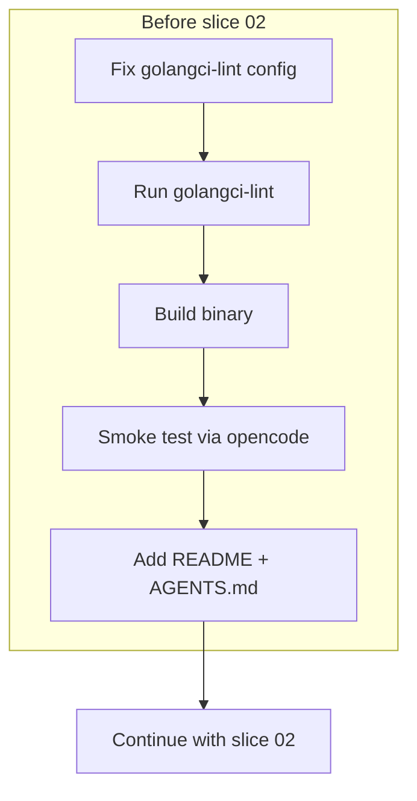

# 0002: Hand-Rolled MCP Protocol and Project Hygiene

## Status
Superseded — "keep hand-rolled" rejected after smoke test failure. Adopting `go-sdk/mcp` (see ADR 0001). Project hygiene decisions remain valid.

## Context
After completing slice 01, several gaps were identified:

1. **ADR 0001 says use `go-sdk/mcp`**, but the actual implementation is hand-rolled JSON-RPC 2.0 over stdio. The hand-rolled approach works and has zero external dependencies (only test deps).
2. **No project documentation** exists — no README for humans, no AGENTS.md for LLM-assisted development.
3. **golangci-lint config** was added but still has a placeholder `github.com/my/project` for the local-prefixes setting.
4. **The acceptance test uses fakes** for both integration boundaries (MCP client→server and server→Bexio API). Neither boundary has been validated against a real system.
5. **Go interfaces** — only `timesheetCreator` exists. As slices 02–05 add tools, the question is whether to add interfaces preemptively or grow them organically.

## Decision

### ~~Keep hand-rolled MCP, update ADR 0001~~ → REJECTED
The protocol surface appeared small (initialize, tools/list, tools/call), but the hand-rolled implementation failed against a real MCP client (opencode timeout after 30s). Root cause: unknown protocol compliance gap. Adopting `github.com/modelcontextprotocol/go-sdk/mcp` instead. See slice 01c.

### Grow interfaces per-slice, not preemptively
Add small consumer-side interfaces (Go idiomatic) as each slice needs them. Don't create a mega-interface upfront.

### Smoke test before more slices
Before building slices 02–05, validate the two untested integration boundaries by running the built binary through opencode (real MCP client). This is a manual smoke test + golangci-lint pass, not a new automated test.

### Add README and AGENTS.md
- README: human-focused — what the project does, how to build/run/configure
- AGENTS.md: LLM-focused — project conventions, architecture pointers, workflow instructions

### Fix golangci-lint config
Replace placeholder `github.com/my/project` with `github.com/tricktron/bexio-mcp`.

## Alternatives Considered

| Alternative | Why rejected |
| --- | --- |
| ~~Adopt go-mcp SDK now~~ | ~~Working code with no user-facing benefit from rewrite~~ → Now adopted: hand-rolled failed smoke test |
| Preemptive interfaces for all Bexio operations | Over-engineering; Go idiom favors small interfaces added when needed |
| Contract test against real Bexio API | Needs create+delete (slice 04 not done); manual smoke test validates both boundaries in one shot |
| Skip smoke test, trust fakes | Both integration boundaries are untested; too risky before building 4 more slices on this foundation |

## Diagram

## Consequences
- ADR 0001 updated to say "go-sdk/mcp" (reverted from hand-rolled after smoke test failure)
- Manual smoke test gated further slice work — protocol was broken, now fixing with SDK (slice 01c)
- golangci-lint may surface issues in existing code that need fixing
- README and AGENTS.md added as project documentation
- Interfaces grow organically per slice
