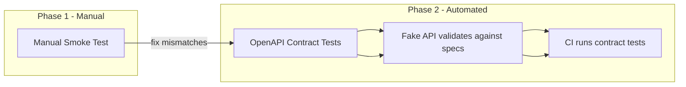

# 0003: Manual Smoke Test Then OpenAPI Contract Tests

## Status
Accepted

## Context
We have a working MCP server with two test layers (unit + acceptance), but both test against hand-crafted fakes. We don't know if the code works against the real Bexio API. Key unknowns:

1. Do our request shapes match what Bexio expects? (e.g., `tracking.start` format — our code sends `"09:00"`, but the OpenAPI spec shows `"2019-05-20 14:22:48"`)
2. Do our response structs capture enough fields? (real responses have `status_id`, `charge`, `date`, `duration`, `running`, etc. that `bexioTimesheet` ignores)
3. Does our fake API in `server_test.go` behave like the real one?

We already have 6 OpenAPI specs extracted from Bexio's Redocly docs in `docs/`.

## Decision
Two-phase approach:

### Phase 1: Manual smoke test against real Bexio
Run the built binary through a real MCP client (opencode), perform a create → list → search → edit → delete cycle against the production Bexio instance. Document any mismatches found. Clean up test data immediately via delete.

### Phase 2: OpenAPI contract tests for fake API
Write Go tests that validate the fake Bexio API (`startFakeBexioAPI` in `server_test.go`) against the OpenAPI specs in `docs/`. These tests verify:
- Fake response bodies match the OpenAPI response schemas
- Fake request handling accepts the shapes defined in the OpenAPI request schemas
- Status codes match what the spec says

This runs in CI with zero side effects.

## Alternatives Considered

| Alternative | Why rejected |
| --- | --- |
| Recorded contract tests against real API | Higher complexity (cleanup logic, token management, CI flakiness), solves a problem we don't have yet — we haven't confirmed docs are wrong |
| OpenAPI-generated mock server (e.g., Prism) | Extra tooling dependency, still wouldn't validate our Go struct shapes match the spec |
| Skip manual test, go straight to contract tests | We don't know if the basics work — 5 min manual test catches showstoppers before investing in automation |

## Diagram

## Consequences
- Manual test may reveal struct mismatches (likely: tracking date-time format, missing response fields) that need fixing before contract tests
- Contract tests add a Go OpenAPI validation dependency (e.g., `libopenapi-validator` or `kin-openapi`)
- Fake API becomes a tested artifact — changes to fakes must pass schema validation
- OpenAPI specs in `docs/` become the source of truth for expected API behavior
