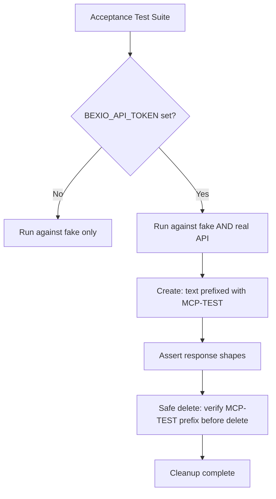

# 0004: Real API Contract Tests Replace OpenAPI Validation

## Status
Accepted (supersedes Phase 2 of ADR 0003)

## Context
ADR 0003 planned two phases: manual smoke test (done) → OpenAPI spec validation of fakes. The smoke test proved valuable — it found 4 real issues. But validating fakes against OpenAPI specs has a gap: specs can be stale or incomplete, and they don't catch behavioral differences (e.g., the 415 on `POST /pr_project/search` with `[]` body).

We have an eportal contract test in another project that runs the same test suite against both an in-memory fake and the real API. This pattern directly proves fakes are correct.

## Decision
Replace the planned OpenAPI contract tests (slice 09) with environment-polymorphic acceptance tests:

1. **Same test cases** run against both fake (`httptest.Server`) and real (`api.bexio.com`) backends
2. **Real-API mode** gated by `BEXIO_API_TOKEN` env var — skipped when absent, CI stays fast
3. **Test timesheet identification**: All test timesheets use the text prefix `[MCP-TEST]` so they are easily searchable and identifiable in the Bexio UI
4. **Safe cleanup**: Delete operations use a `safeDeleteTestTimesheet` helper that first fetches the timesheet by ID and verifies it carries the `[MCP-TEST]` prefix before deleting — never deletes non-test data
5. **Assertion modes**: Fake mode asserts exact IDs and captured HTTP requests. Real mode asserts response shapes, field presence, and `[MCP-TEST]` prefix on created entries

### Test Timesheet Safety Strategy
- **Prefix**: `[MCP-TEST]` in the `text` field of every timesheet created by contract tests
- **Search**: Contract tests can search for `[MCP-TEST]` entries to verify list/search operations
- **Delete guard**: Before any delete, fetch the timesheet and assert `strings.HasPrefix(text, "[MCP-TEST]")` — fail the test rather than deleting an unknown entry
- **Manual fallback**: If cleanup fails, you can search for `[MCP-TEST]` in the Bexio UI and delete manually

## Alternatives Considered

| Alternative | Why rejected |
| --- | --- |
| OpenAPI spec validation (ADR 0003 Phase 2) | Specs can be stale; doesn't catch behavioral issues like 415 on search. Adds OpenAPI library dependency for indirect validation. |
| Separate `contract_test.go` with `DisallowUnknownFields` only | Only validates struct shapes, doesn't prove fakes are correct. Fake drift remains undetected. |
| Random UUID in text field | Harder to search for in UI. Prefix is grep-friendly and human-readable. |

## Diagram

## Consequences
- Fakes are proven correct by the real API, not by a potentially stale spec
- No OpenAPI library dependency needed
- Real API tests are slow (~seconds per call) — run locally or in nightly CI, not on every push
- Test data is always identifiable and safely deletable
- Slice 09 is replaced; slice 10 (fix smoke test findings) remains a prerequisite since fakes must be realistic before polymorphic tests can share assertions
