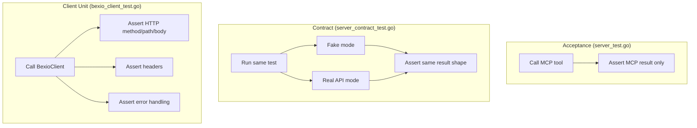

# 0005 — Separate Acceptance and Client Test Concerns

Date: 2026-02-14

## Status

Accepted

## Context

Acceptance tests in `server_test.go` assert on both MCP tool results (user journey) and HTTP request internals (method, path, auth header, body). This violates the test pyramid:

```
Acceptance (server_test.go)        → User journey: MCP tool in → result out
Contract (server_contract_test.go) → Fake correctness: same assertions, fake vs real API
Client unit (bexio_client_test.go) → HTTP encoding: method, path, headers, body, errors
```

The contract tests (ADR 0004) already prove fakes match the real API. The client unit tests already cover HTTP encoding. The acceptance tests duplicating HTTP assertions adds no coverage — it just couples user journey tests to transport details.

10 of 12 `bexio_client_test.go` tests assert the same HTTP contracts that acceptance tests duplicate. Two are unique:
- `TestBexioClientReturnsErrorOnNon2xxStatus` (error handling)
- `TestBexioClientSendsAcceptHeader` (Accept header)

## Decision

Clean separation by test level:

- **Acceptance tests** (`server_test.go`) assert **only** on MCP results: `result.IsError`, `result.Content` shape/values. They are the user journey.
- **Contract tests** (`server_contract_test.go`) validate that the fake and real API produce the same observable results. They prove fake correctness.
- **Client unit tests** (`bexio_client_test.go`) own **all** HTTP encoding assertions: method, path, auth header, request body, error handling. They are fast and always run.

Remove all `env.fakeAPI.Received()` assertions from acceptance tests.

## Alternatives Considered

**Keep status quo (acceptance tests assert both).** Rejected — conflates user journey with transport encoding, makes acceptance tests brittle to HTTP changes, and duplicates coverage already provided by client unit tests and contract tests.

## Diagram



## Consequences

- Acceptance tests become shorter and focused on user-visible behavior.
- HTTP contract changes only require updating `bexio_client_test.go`.
- Fake correctness is proven by contract tests, not by acceptance test HTTP assertions.
- The `fakeBexioAPI` capture infrastructure in `server_test.go` can be simplified (no longer needs `Received()` for assertion — only needs to route requests and return canned responses).
- Issue 5 from ADR 0003 (lookup test duplication) becomes easier to address since acceptance tests will have a simpler, uniform assertion pattern.
