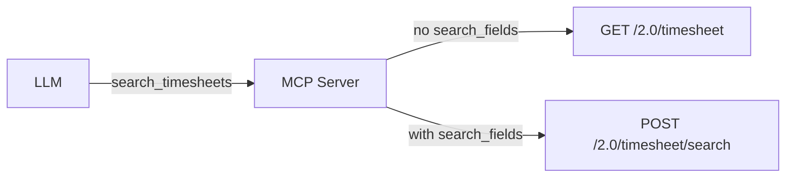

# 0006: Merge list_timesheets and search_timesheets into a single tool

## Status
Accepted

## Context
The MCP server exposes two tools for retrieving timesheets:
- `list_timesheets`: calls `GET /2.0/timesheet`, accepts optional `date_from`/`date_to` (client-side filtering)
- `search_timesheets`: calls `POST /2.0/timesheet/search`, requires `search_fields`, accepts optional `date_from`/`date_to`

Both tools have the same goal — retrieve timesheets matching criteria — and return the same response type. An LLM consumer cannot reliably distinguish when to use which tool. Per MCP best practices, each tool should have a single responsibility with a single goal and a clear schema so the LLM knows when to use it.

Additionally, `list_timesheets` with `date_from`/`date_to` performs client-side filtering on up to 2000 entries, while `search_timesheets` could achieve the same result more efficiently via server-side filtering. The LLM has no way to reason about this difference.

## Decision
Merge both tools into a single `search_timesheets` tool with optional `search_fields`:
- When `search_fields` is omitted or empty → call `GET /2.0/timesheet` (list all)
- When `search_fields` is provided → call `POST /2.0/timesheet/search`

Remove the `list_timesheets` tool entirely.

The bexio API requires a request body for the search endpoint (`POST /2.0/timesheet/search`), so the conditional dispatch based on `search_fields` presence maps cleanly to the two underlying API endpoints.

## Alternatives Considered
**Keep both tools (status quo)**: 1:1 mapping with bexio API endpoints. Rejected because the two tools share the same goal, creating ambiguity for LLM tool selection. The API boundary is an implementation detail, not a user-facing concern.

## Diagram

## Consequences
- **Breaking change**: Clients using `list_timesheets` by name must switch to `search_timesheets` (with no required params).
- **Simpler tool surface**: One fewer tool for the LLM to reason about.
- **Conditional dispatch**: The handler gains a branch (`if search_fields empty → GET else → POST`), but this is minimal complexity.
- **Clearer schema**: One tool with one goal: "retrieve timesheets, optionally filtered by field criteria and/or date range."
