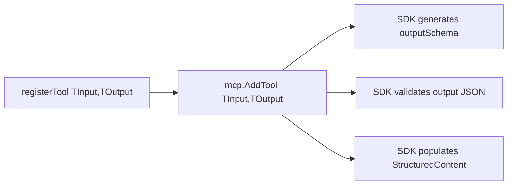

# 0008: Typed Output Schemas for MCP Tools

## Status
Accepted

## Context
`registerTool` hardcodes `mcp.AddTool[TInput, any]`, erasing the output type. The Go MCP SDK auto-generates `outputSchema` in `tools/list`, validates output JSON, and populates `StructuredContent` — but only when `TOutput` is not `any`. Today, LLM clients get zero information about what tools return.

## Decision
Make `registerTool` generic over both `TInput` and `TOutput`. Pass concrete output types so the SDK generates output schemas, validates responses, and populates structured content automatically.

For tools returning slices (e.g. `[]bexioTimesheet`), wrap in a struct since the SDK requires `outputSchema.type == "object"` (Out type must be map or struct).

Phased rollout:
1. **Slice 23**: Type the 4 timesheet tools (create, edit, delete, search) — these already have typed structs or simple response shapes.
2. **Slice 26**: Type the 6 lookup tools (contacts, projects, client_services, packages, timesheet_statuses, users) — requires defining new response structs and changing `BexioClient` from `json.RawMessage`.

## Alternatives Considered
- **Manual `OutputSchema` on `Tool` struct**: Could set `tool.OutputSchema` manually without changing `TOutput`. Rejected because it skips SDK validation and `StructuredContent` population — half the benefit.
- **All tools in one slice**: Rejected because lookup tools require new response structs + `BexioClient` changes + missing API docs, making the scope too large.

## Diagram

## Consequences
- Timesheet tools (4) get output schemas immediately (slice 23)
- Lookup tools (6) get output schemas in follow-up (slice 26)
- SDK validates output at runtime — mismatches become errors instead of silent corruption
- Need wrapper structs for slice responses (minor boilerplate)
- Breaking change for `registerTool` callers (all in `main.go`, internal only)
