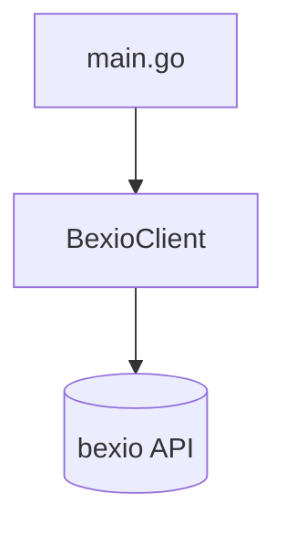

---

## 2026-02-08: Project Setup & Create Timesheet

### Acceptance Test
- Entry: MCP tool `create_timesheet` over stdio transport
- Verified: Tool call creates a bexio timesheet via `POST /2.0/timesheet` and returns the created entry

### Architecture

### Functional Core
- BexioClient: HTTP shell client for bexio timesheet creation

### Unit Tests (1)
| Component | Tests | Behaviors |
| --------- | ----- | --------- |
| BexioClient | 1 | POST /2.0/timesheet with Bearer auth and expected body/response |

### Stats
- Iterations: 1

### Discoveries
None

### Recall Answers
N/A
