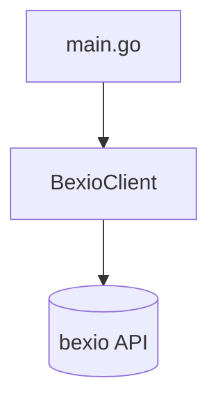
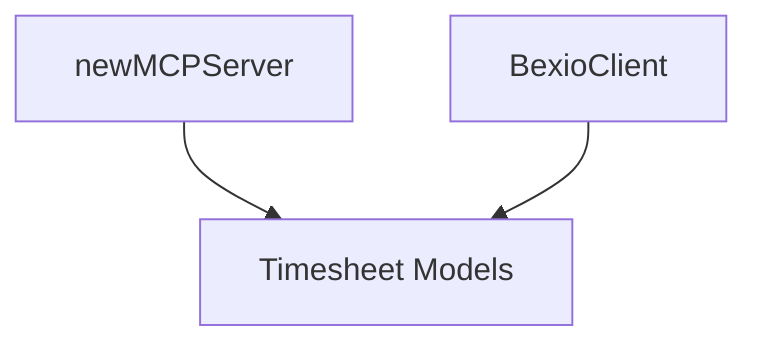
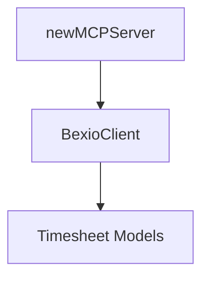
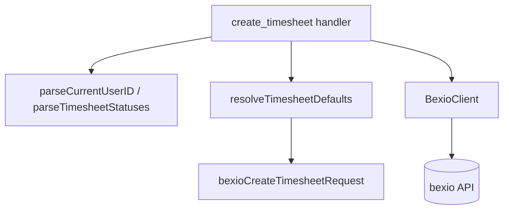
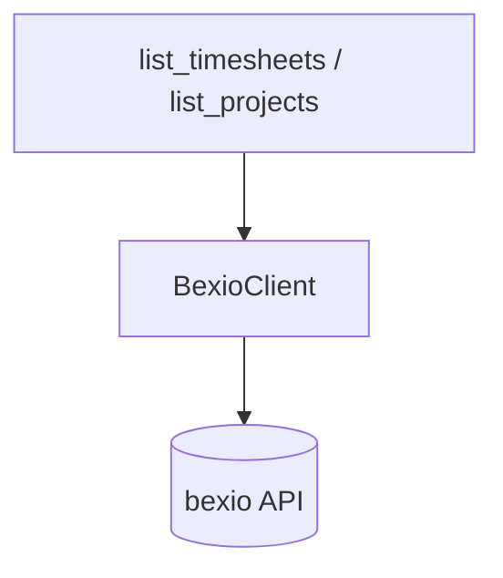

---

## 2026-02-08: Project Setup & Create Timesheet

### Acceptance Test
- Entry: MCP tool `create_timesheet` over stdio transport
- Verified: Tool call creates a bexio timesheet via `POST /2.0/timesheet` and returns the created entry

### Architecture


### Functional Core
- BexioClient: HTTP shell client for bexio timesheet creation

### Unit Tests (1)
| Component | Tests | Behaviors |
| --------- | ----- | --------- |
| BexioClient | 1 | POST /2.0/timesheet with Bearer auth and expected body/response |

### Stats
- Iterations: 1

### Discoveries
None

### Recall Answers
1. Added ListTimesheets and SearchTimesheets methods to BexioClient
2. That list and search timesheet tools work end-to-end and return data via MCP
3. Nothing — straightforward slice

---

## Slice: 01c — Adopt MCP SDK

### Date
2026-02-09

### Acceptance Test
`TestCreateTimesheetAcceptance` — SDK client connects in-process, calls `create_timesheet`, verifies Bexio API request and tool result content.

### Architecture


### Core Classes Discovered
None — pure shell rewrite.

### Unit Tests
None — shell wiring only, covered by acceptance test.

### Discoveries
- `assumption-invalid`: Hand-rolled JSON-RPC passed unit tests but failed against real MCP client (opencode 30s timeout). Root cause unknown. Adopted `go-sdk/mcp` which works immediately.

### Recall
(pending)

---

## 2026-02-10: List & Search Timesheets

### Acceptance Test
- Entry: MCP tools `list_timesheets` and `search_timesheets`
- Verified: Tool calls map to `GET /2.0/timesheet` and `POST /2.0/timesheet/search` and return matching timesheet entries

### Architecture


### Functional Core
- bexioSearchField: Search filter contract shared by MCP and HTTP layers
- bexioSearchTimesheetsRequest: MCP request envelope for search filters
- bexioTimesheet: Response model shared across boundaries

### Unit Tests (3)
| Component | Tests | Behaviors |
| --------- | ----- | --------- |
| BexioClient | 3 | GET timesheets, POST search filters, auth/header and JSON decoding behavior |

### Stats
- Iterations: 1

### Discoveries
None

### Recall Answers
N/A

## Slice 05: Timesheet Status & Current User

### Acceptance Tests
- `TestListTimesheetStatusesAcceptance`: calls `list_timesheet_statuses`, verifies GET /2.0/timesheet_status, response contains "Erledigt"
- `TestGetCurrentUserAcceptance`: calls `get_current_user`, verifies GET /3.0/users/me, response contains "Rudolph"

### Architecture
No structural changes - both tools reuse the existing `getRaw` shell pattern.

### Core Classes Discovered
None.

### Unit Tests
None needed - no new core logic.

### Observations
- Both endpoints are pure HTTP passthrough with no domain logic
- The slice as written doesn't contain the "resolve defaults" behavior - that logic would live in a future slice that uses these lookup tools
- TDD ceremony was skipped since there was no new behavior to drive

## Slice 03: Lookup Tools (Contacts, Projects, Packages, Services)

### Acceptance Tests
| Test | Verifies |
| ---- | -------- |
| TestListContactsAcceptance | list_contacts → GET /2.0/contact → returns contacts |
| TestListProjectsAcceptance | list_projects with contact_id → POST /2.0/pr_project/search → returns projects |
| TestListPackagesAcceptance | list_packages with project_id → GET /3.0/projects/{id}/packages → returns packages |
| TestListClientServicesAcceptance | list_client_services → GET /2.0/client_service → returns services |

### Architecture
```mermaid
graph LR
    MCP[MCP Tools] --> BC[BexioClient]
    BC --> |getRaw| GET[GET endpoints]
    BC --> |postRaw| POST[POST /search]
    GET --> contacts[/2.0/contact]
    GET --> services[/2.0/client_service]
    GET --> packages[/3.0/projects/id/packages]
    POST --> projects[/2.0/pr_project/search]
```

### Core Classes Discovered
None — all lookup tools are thin shells passing raw JSON through.

### Unit Tests
| Test | Component | Behavior |
| ---- | --------- | -------- |
| TestBexioClientListContacts | BexioClient | GET /2.0/contact with auth, returns raw JSON |
| TestBexioClientListClientServices | BexioClient | GET /2.0/client_service with auth, returns raw JSON |
| TestBexioClientListPackages | BexioClient | GET /3.0/projects/5/packages with auth, returns raw JSON |
| TestBexioClientSearchProjects | BexioClient | POST /2.0/pr_project/search with contact_id filter |

### Discoveries
None.

### Iterations
4 (one per tool)

### Refactoring Highlights
- Extracted `getRaw`/`postRaw`/`readRawResponse` helpers to eliminate duplication
- Extracted generic `registerTool[TInput]` to reduce MCP tool registration boilerplate
- Moved lookup input DTOs to `lookup.go`
- Removed empty `contact.go` placeholder

---

## 2026-02-13: Edit & Delete Timesheet

### Acceptance Test
- Entry: MCP tools `edit_timesheet` and `delete_timesheet`
- Verified: Tool calls map to `POST /2.0/timesheet/{id}` and `DELETE /2.0/timesheet/{id}` and return updated/deletion responses

### Architecture


### Functional Core
- bexioEditTimesheetRequest: MCP envelope combining `id` with editable timesheet fields
- bexioDeleteTimesheetRequest: MCP envelope for delete-by-id input

### Unit Tests (2)
| Component | Tests | Behaviors |
| --------- | ----- | --------- |
| BexioClient | 2 | POST edit payload to `/2.0/timesheet/{id}`, DELETE `/2.0/timesheet/{id}` and return raw success body |

### Stats
- Iterations: 1

### Discoveries
None

### Recall Answers
N/A

---

## 2026-02-13: Auto-resolve Timesheet Defaults

### Acceptance Test
- `TestCreateTimesheetAutoResolveDefaultsAcceptance`: calls `create_timesheet` without `user_id`/`status_id`, verifies POST body contains resolved user_id=4 (from /users/me) and status_id=2 (from /timesheet_status -> "Erledigt")

### Architecture


### Core Classes Discovered
- `resolveTimesheetDefaults` — pure mapper: optional inputs + lookup results -> resolved request
- `resolveUserID` / `resolveStatusID` — resolution helpers
- `parseCurrentUserID` / `parseTimesheetStatuses` — JSON -> domain type parsers
- `timesheetStatus` — `{ID, Name}` domain type
- `createTimesheetInput` — MCP-facing input with optional user_id/status_id

### Unit Tests
| Test | Component | Behavior |
| ---- | --------- | -------- |
| TestResolveTimesheetDefaults (3 cases) | resolveTimesheetDefaults | Resolves missing defaults, preserves explicit values |
| TestParseCurrentUserID (2 cases) | parseCurrentUserID | Parses user ID from JSON, errors on malformed |
| TestParseTimesheetStatuses (2 cases) | parseTimesheetStatuses | Parses status list from JSON, errors on malformed |

### Stats
- Iterations: 3

### Discoveries
None

### Recall Answers
Skipped

---

## 2026-02-14: Fix Smoke Test Findings

### Acceptance Test
- Entry: `go test ./...` via `server_test.go`
- Verified: `TestListTimesheetsAcceptance` returns realistic datetime tracking and core timesheet fields; `TestListProjectsWithoutContactIDAcceptance` uses `GET /2.0/pr_project` when `contact_id` is absent.

### Architecture


### Functional Core
- None: no new core classes in this slice.

### Unit Tests (2)
| Component | Tests | Behaviors |
| --------- | ----- | --------- |
| BexioClient | 2 | Decodes core timesheet response fields in list responses; lists projects via `GET /2.0/pr_project` |

### Stats
- Iterations: 1

### Discoveries
None

### Recall Answers
N/A
