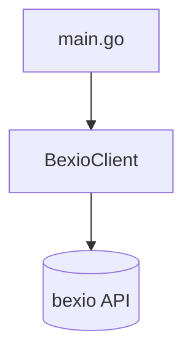
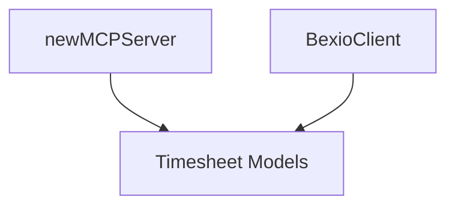

---

## 2026-02-08: Project Setup & Create Timesheet

### Acceptance Test
- Entry: MCP tool `create_timesheet` over stdio transport
- Verified: Tool call creates a bexio timesheet via `POST /2.0/timesheet` and returns the created entry

### Architecture

### Functional Core
- BexioClient: HTTP shell client for bexio timesheet creation

### Unit Tests (1)
| Component | Tests | Behaviors |
| --------- | ----- | --------- |
| BexioClient | 1 | POST /2.0/timesheet with Bearer auth and expected body/response |

### Stats
- Iterations: 1

### Discoveries
None

### Recall Answers
N/A

---

## Slice: 01c — Adopt MCP SDK

### Date
2026-02-09

### Acceptance Test
`TestCreateTimesheetAcceptance` — SDK client connects in-process, calls `create_timesheet`, verifies Bexio API request and tool result content.

### Architecture

### Core Classes Discovered
None — pure shell rewrite.

### Unit Tests
None — shell wiring only, covered by acceptance test.

### Discoveries
- `assumption-invalid`: Hand-rolled JSON-RPC passed unit tests but failed against real MCP client (opencode 30s timeout). Root cause unknown. Adopted `go-sdk/mcp` which works immediately.

### Recall
(pending)

---

## 2026-02-10: List & Search Timesheets

### Acceptance Test
- Entry: MCP tools `list_timesheets` and `search_timesheets`
- Verified: Tool calls map to `GET /2.0/timesheet` and `POST /2.0/timesheet/search` and return matching timesheet entries

### Architecture

### Functional Core
- bexioSearchField: Search filter contract shared by MCP and HTTP layers
- bexioSearchTimesheetsRequest: MCP request envelope for search filters
- bexioTimesheet: Response model shared across boundaries

### Unit Tests (3)
| Component | Tests | Behaviors |
| --------- | ----- | --------- |
| BexioClient | 3 | GET timesheets, POST search filters, auth/header and JSON decoding behavior |

### Stats
- Iterations: 1

### Discoveries
None

### Recall Answers
N/A
